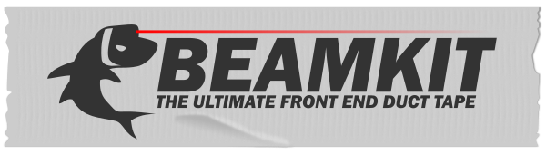

# 

[](https://travis-ci.org/foxbunny/beamkit)

BeamKit is a front end development framework. It features not only the usual 
functionality for rendering your views, but also for making requests, 
application-wide custom events for building event-driven architectures, form 
validation, and more to come.

Beamkit is a mix of all the ideas that have worked well for the author in the
previous years of experience. Kind of like putting lasers on sharks. The 
good stuff, so to say, all bundled together with a good measure of duct tape.

## Status

BeamKit is still a work in progress. It's usable as it is, but it's not in the 
final form. See the [issue tracker](bit.ly/beamkit-issues) for roadmaps.

## Core functionality

- JSX-compatible DOM node creation.
- Component-less event-driven architecture with a simple pub-sub system.
- XHR requests with middleware-style plugins.
- URL-to-state (de)serialization for flexible routing.
- Efficient DOM diffing for keyed node lists.

## Features 

- Compatible with Babel's `@babel/plugin-transform-react-jsx` plugin.
- Designed for imperative programs, the way JavaScript likes it.
- Designed for modern browsers (untranspiled ES6, no polyfills, no boilerplate).
- Extremely low footprint: 4KB min+gz (we aim at less than 1000 lines total).

## Supported browsers

- Latest Webkit-based and Firefox browsers
- No IE11 or any older version

## Documentation

- [Creating DOM nodes using JSX](./docs/h.md)
- [Efficiently updating lists of DOM nodes](./keyed-list.md)
- [Custom events](./docs/hub.md)
- [Making XHR requests](./docs/xhr.md)
- [Client-side routing](./docs/urlstate.md)
- [Browser APIs](./docs/browser.md)

## Installation

For now, install directly from GitHub repository:

```
npm i https://github.com/foxbunny/beamkit/
```

## License

Beamkit is released under the terms of the ICS license. See the LICENSE file in 
the [source repository](bit.ly/beamkit-license).
